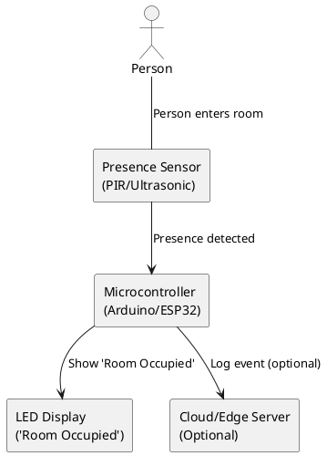

# Door-Notification-Arduino-
A system that detects the presence of a person in the room and displays a notification "Room Occupied" on a screen.

# Room Occupancy Detection and Notification System Architecture

## Overview

This system detects the presence of a person in a room and displays a "Room Occupied" notification on an LED screen.

---

## Components

1. **Person Detection Sensor**
   - *Type:* PIR (Passive Infrared) Sensor, Ultrasonic Sensor, or Camera Module (optional for advanced detection).
   - *Function:* Senses motion or presence of a person in the room.

2. **Microcontroller Unit (MCU)**
   - *Examples:* Arduino, ESP32, Raspberry Pi.
   - *Function:* Reads sensor data, processes it, and triggers notification logic.

3. **LED Display Module**
   - *Examples:* 16x2 LCD, OLED Display, LED Matrix.
   - *Function:* Displays “Room Occupied” message.

4. **(Optional) Cloud/Edge Server**
   - *Function:* For logging, remote monitoring, or advanced analytics (optional for simple notification).

5. **Power Supply**
   - *Function:* Supplies power to the sensor, MCU, and display.

---

## System Flow

1. **Detection:**  
   Person enters the room → Sensor detects presence.

2. **Processing:**  
   Sensor sends signal to Microcontroller.

3. **Notification:**  
   Microcontroller processes signal → Sends command to LED Display to show “Room Occupied”.

4. **(Optional) Logging:**  
   Microcontroller sends event data to Cloud/Edge Server for record-keeping/analytics.

---

## Text-Based Architecture Diagram

```
+--------------------+         +-------------------+         +-------------------+
| Person Detection   |         |   Microcontroller |         |   LED Display     |
| Sensor (PIR/etc.)  +-------->+   (Arduino/etc.)  +-------->+   ("Room Occupied")|
+--------------------+         +-------------------+         +-------------------+
        |                               |
        |                               |
        |                               v
        |                   +----------------------+
        |                   | (Optional) Cloud/    |
        +------------------>+ Edge Server (Log/AI) |
                            +----------------------+
```

---

## PlantUML Diagram

Paste the following code into a PlantUML editor (or use the [PlantUML Online Server](https://www.plantuml.com/plantuml/uml/) to generate an image):



---

## Rendering the Diagram

- You can render the PlantUML code as an image using:
  - [PlantUML Online Server](https://www.plantuml.com/plantuml/uml/)
  - PlantUML plugins for VS Code or IntelliJ IDEA
  - GitHub Actions or CI pipelines with PlantUML

---

## Summary

- **Sensor** detects presence
- **Microcontroller** processes detection
- **LED Display** shows notification
- **Optional:** Cloud/Edge integration for logging

---
